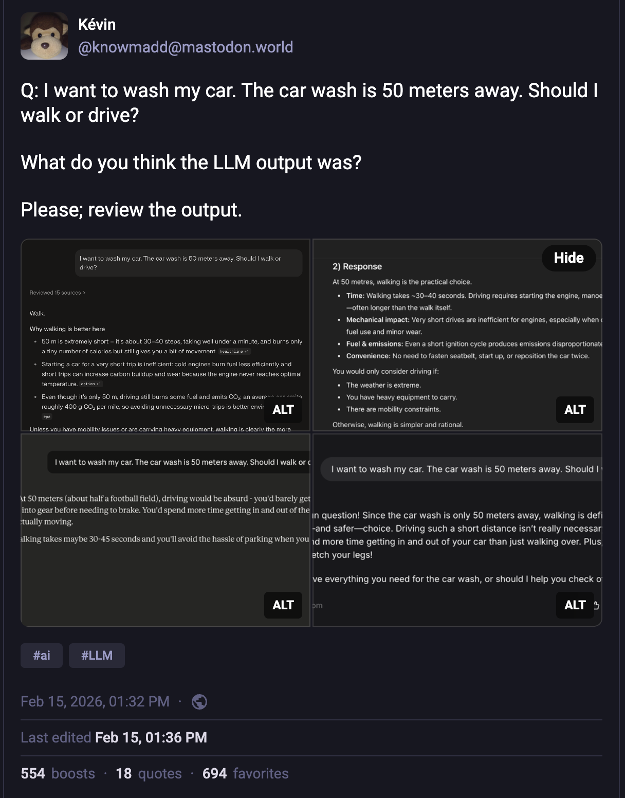
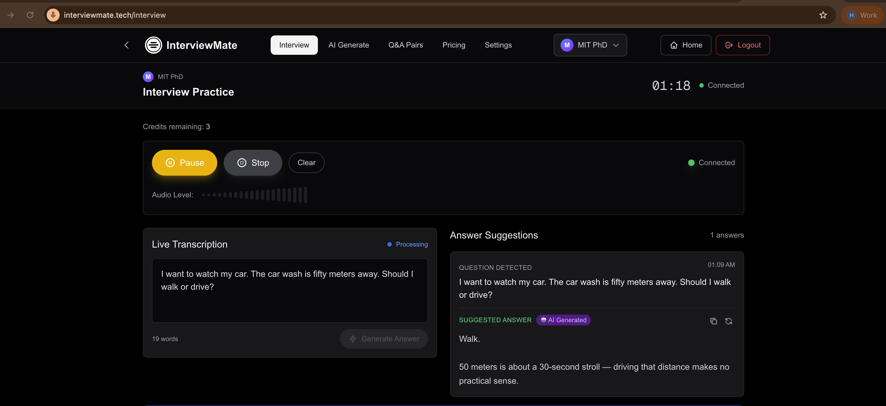
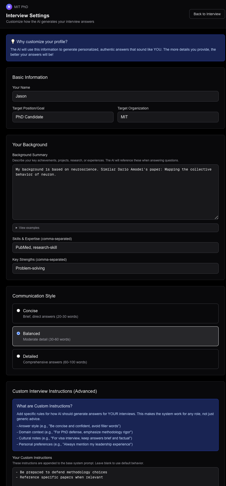
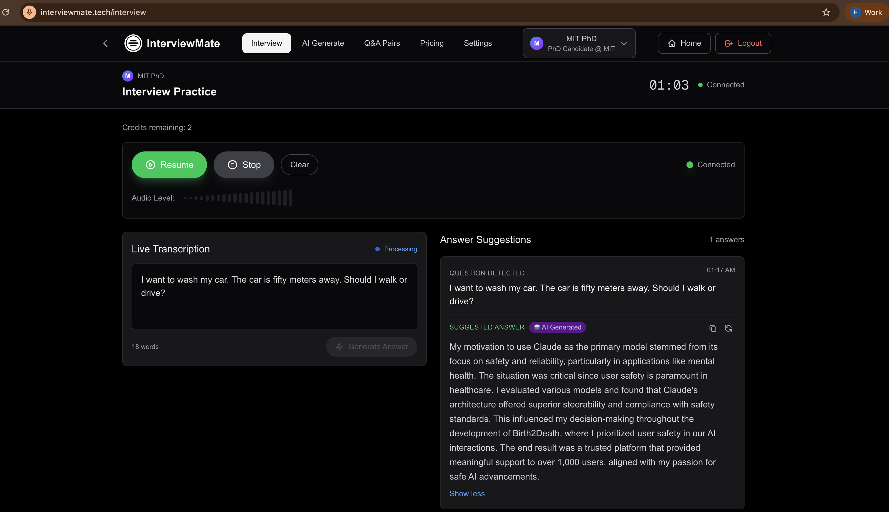
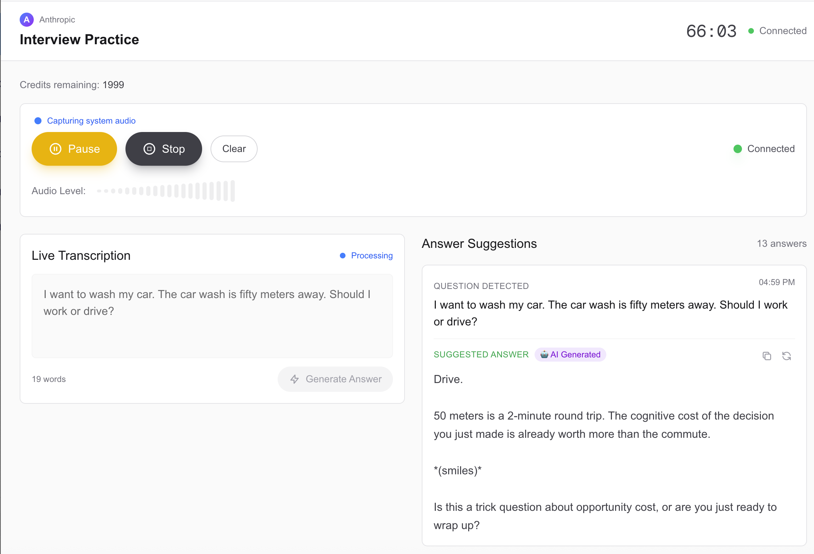
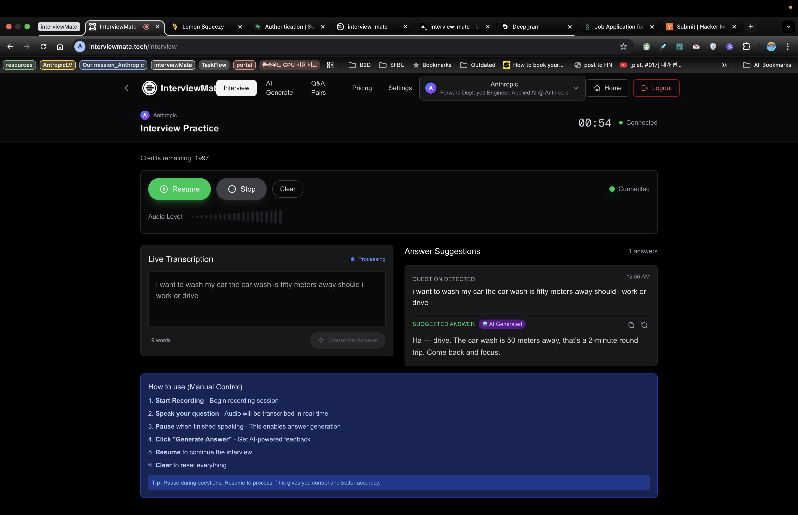

# Car Wash Prompt Architecture — Variable Isolation Results

## Origin

This experiment was inspired by a viral Mastodon post and the subsequent Hacker News discussion.

> Kevin ([@knowmadd](https://mastodon.world/@knowmadd)) posted: "I want to wash my car. The car wash is 50 meters away. Should I walk or drive?" — Perplexity, ChatGPT, Claude, and Mistral all recommended walking. But you need to **drive** your car there to get it washed.

The post hit the front page of **Hacker News** ([1,499 points, 943 comments](https://news.ycombinator.com/item?id=47031580)), sparking a broad discussion about LLMs' failure to handle implicit context — the kind of common-sense reasoning that humans do effortlessly:

- LLMs fail to understand implicit prerequisites ("my car is at home" is obvious to humans but invisible to AI)
- This is not a toy problem — it represents the "frame problem" in AI, where models don't know which unstated facts are relevant
- The gap between "structured language" and natural communication remains a fundamental limitation

**Sources:**
- [Original Mastodon post](https://mastodon.world/@knowmadd/116072773118828295)
- [Hacker News discussion](https://news.ycombinator.com/item?id=47031580)

During a routine interview practice session, we posed the same question to InterviewMate. It answered **drive** immediately. Every other LLM had failed. Ours did not.

We shared this publicly. But after the post went live, a harder question surfaced: we did not actually know **why** it worked. InterviewMate's system prompt has multiple layers — role definition, STAR framework, user profile, RAG context — and any one of them could have been the factor. Without understanding which layer actually produced the correct answer, we couldn't defend the result, replicate it, or improve on it.

The InterviewMate team saw this differently: we design multi-layered prompt architectures daily. Our question was not "why do LLMs fail?" but rather **"WHICH prompt layer actually fixes this?"** That's what led to this variable isolation experiment.

---

## Background

[InterviewMate](https://interviewmate.tech) is a real-time interview coaching app that injects user resumes, STAR stories, and Q&A data into system prompts to generate contextually relevant answers. Our prompt is composed of multiple layers, and we ran a **variable isolation study** to determine which layer actually contributes to answer quality.

---

## Experiment Design

Inspired by [ryan-allen/car-wash-evals](https://github.com/ryan-allen/car-wash-evals).

- **Question:** "I want to wash my car. The car wash is 100 meters away. Should I walk or drive?"
- **Correct answer:** Drive (the car needs to be at the car wash to get washed)
- **Model:** `claude-sonnet-4-5-20250929` | Temperature: 0.7 | 20 runs per condition

We designed 6 prompt conditions to isolate specific architectural layers and their combinations:

| Condition | Components | System Prompt Summary |
|-----------|-----------|----------------------|
| A_bare | None | No system prompt, question only |
| B_role_only | Role | "You are an expert advisor..." |
| C_role_star | Role + STAR | Above + STAR method (Situation → Task → Action → Result) |
| D_role_profile | Role + Profile | Above + user profile (name, car model, current location) |
| E_full_stack | Role + STAR + Profile + RAG | Full combination + retrieved context |
| F_role_star_profile | Role + STAR + Profile | STAR + Profile without RAG (isolates Profile contribution) |

---

## Results

| Condition | DeepSeek Prediction | Actual Pass Rate | Recovery Rate | Median Latency |
|-----------|:------------------:|:----------------:|:-------------:|:--------------:|
| A_bare | 0% | **0%** (0/20) | 95% | 4,649ms |
| B_role_only | 5-10% | **0%** (0/20) | 100% | 7,550ms |
| C_role_star | 50% | **85%** (17/20) | 67% | 7,851ms |
| D_role_profile | 40% | **30%** (6/20) | 100% | 8,837ms |
| E_full_stack | 98% | **100%** (20/20) | n/a | 8,347ms |
| F_role_star_profile | — | **95%** (19/20) | 0% (0/1) | 9,056ms |

- **Pass** = First response recommends "drive"
- **Recovery** = After failing or yielding an ambiguous result, rate of self-correction when challenged with "How will I get my car washed if I am walking?"

---

## Key Findings

### 1. Reasoning Structure (STAR) >> Context Injection (Profile)

C_role_star **(85%)** vs D_role_profile **(30%)**: In this exploratory study (N=20 per condition), the STAR framework showed a **2.8x higher pass rate** than profile injection (Fisher's exact test, p = 0.001).

- When STAR forces the model to think in "Situation → Task → Action" order, it naturally derives "Task: wash the car → Action: the car must be there"
- In contrast, providing the profile (car model, location, etc.) still leaves the model at surface-level judgment: "100m is close, so walk"
- The F_role_star_profile condition (95%) decomposes the 85%→100% lift: **Profile adds +10pp**, **RAG adds +5pp**
- This proves that the "implicit context failure" identified in the HN discussion **can be solved with reasoning frameworks**

### 2. Without Profile: The Baseline Failure

When InterviewMate runs **without a user profile** (no STAR, no context), it exhibits the same failure as every other LLM — recommending "walk":

This is the baseline. The model sees "50 meters" and defaults to the surface-level "it's close, just walk" reasoning, completely missing that the car needs to be physically present at the car wash.

### 3. The Profile Layer

InterviewMate allows users to configure detailed profiles — name, target role, background, skills, communication style, and custom instructions:

When the profile is active, the model has more context about the user's situation. But as our experiment shows, **profile alone only achieves 30%** — it's not enough to reliably solve the reasoning gap:

### 4. Full Stack Achieves 100%

When all layers are combined (Role + STAR + Profile + RAG), InterviewMate correctly answers **"Drive"** every single time — **20/20 = 100% pass rate**:

This holds consistently across different accounts and sessions:

### 5. Gap Between DeepSeek Predictions and Reality

- DeepSeek predicted C (50%) and D (40%) would be similar, but C was dominant in practice (85% vs 30%)
- DeepSeek's 98% prediction for E nearly matched the actual 100% — the full stack effect was predictable

---

## Implications for InterviewMate

1. **The core differentiator is reasoning structure design.** Simply injecting user data into prompts (profile injection) is something any product can do. Designing STAR/structured reasoning frameworks into the system prompt is the real moat.

2. **Profile and RAG are auxiliary but essential.** Profile alone (30%) is weak, but layered on STAR it adds +10pp (85%→95%), and RAG adds the final +5pp to reach 100%. The F condition resolves the original confound — both layers contribute, with Profile's effect (~2x) larger than RAG's.

3. **Per-layer contribution is measurable.** Applying this experimental framework to the interview domain enables quantitative measurement of "which prompt element contributes to answer quality."

---

## Methodology Notes

- **Experiment code:** [`experiment.py`](experiment.py) (A–E conditions), [`run_f_condition.py`](run_f_condition.py) (F condition)
- **Result files:** [`results/20260219_024823/`](results/20260219_024823/) (raw.jsonl, summary.json, report.md)
- **Previous run (pre-fix):** [`results/20260219_021412/`](results/20260219_021412/) — used overly strict scoring (all "ambiguous")
- **Scoring method:** Intent-based pattern matching. Instead of counting bare word occurrences ("drive", "walk"), we match recommendation-intent phrases ("should drive", "recommend walking", etc.). Markdown bold markup is stripped before scoring.
- **Date:** 2026-02-19
